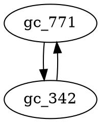
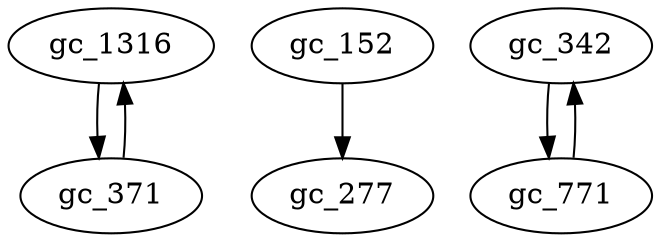

# Running tests

Tests are located in the `./tests/` subdirectory. To run all tests, go to the project's root and run:

```commandline
python3 -m unittest
```

If you only want to run tests contained in a specific file, run:

```commandline
python3 -m unittest tests/SOME_TEST_FILE.py 
```

# Writing tests

You can write your own unit tests manually, but you really don't have to. As long as you have a dataset recognizable by
ISGCI, you can generate new tests.

Tests are automatically generated from the datasets located in the `./tests/test_data/` directory, in which each
subdirectory must be named `name=corresponding_isgci_id` and contains a bunch of files with instances that belong to
that class.

To generate tests, simply go to the `./src/` directory and type:

```commandline
python3 generate_tests.py
```

Testing recognizers is difficult because:

1. relatively few datasets exist,
2. tests are tedious to write.

We get around those two difficulties by generating test sets automatically from a relatively small pool of *positive*
instances (i.e., graphs which are known to belong to some graph class), using the information available in ISGCI on
relations between classes and the simple observation that if a graph $G$ belongs to some class $C$, then it also belongs
to the set $A(C)$ of all ancestors of $C$. Therefore, a recognizer for a class $D\in A(C)$ must return `True` for $G$
if $G\in C$.

# Generating tests

A simple script is readily available for generating tests. Just run:

```commandline
python3 generate_tests.py
```

This generates a collection of unit tests and writes them to the `./tests/` directory.

## Behind the scenes

Tests are generated from the datasets stored in `./tests/test_data/`, where each subdirectory is named
`name=corresponding_isgci_id` and contains a bunch of test files for that class.

### Testing positive instances 

A dataset with members of a given class not only allows us to check positive instances for the corresponding recognizers, but also for all 

### Testing negative instances

TODO now that we have an exclusion graph

# Caveats

So far, we can only test positive instances. We need more information to be able to generate negative instances.

# TODO

I can probably build an "exclusion digraph": if $G$ belongs to some class $C$, then it does **not** belong to some other
class $D$. I cannot do that for every class in ISGCI, and my goal is to generate tests, so let's start with those
classes for which I have a dataset and let's take a concrete example.

2-connected graphs (gc_771) cannot be disconnected by removing fewer than 2 vertices. So if a graph is 2-connected, then
it cannot be a tree (gc_342), and if it is a tree, then it cannot be 2-connected. So the exclusion digraph will at least
be:



Where do we go from here? Well, we can now generate *negative* instances: if $G\in C\Rightarrow G\notin D$, then we know
that our recognizer for class $D$ must return `False`. And the same goes for all descendants of that class $D$.

As of 2024-12-05, we have the following datasets

biconnected=gc_771
bipartite=gc_69
block=gc_93
C4-free=gc_360
chordal=gc_32
circle=gc_132
claw-free=gc_62
cobipartite=gc_486
co-block=AUTO_2774
co-C4-free=gc_394
cochordal=gc_145
co-claw-free=AUTO_79
cographs=gc_151
co-K4-free=gc_674
coplanar=gc_953
cotrees=AUTO_2103
co-triangle-free=AUTO_399
critical h-free
cubic-and-hamiltonian=gc_1316
data sources.txt
distance-regular=gc_1148
K4-free=gc_455
perfect=gc_56
permutation=gc_23
planar=gc_43
regular=gc_1149
split=gc_39
strongly_regular=gc_1185
trees=gc_342
triangle-free=gc_371

So let's see for each pair which are unrelated, and then also check if they exclude one another

-[x] gc_771: the following classes are unrelated to it:
    - gc_69
    - gc_93
    - gc_360
    - gc_32
    - gc_132
    - gc_62
    - gc_486
    - AUTO_2774
    - gc_394
    - gc_145
    - AUTO_79
    - gc_151
    - gc_674
    - gc_953
    - AUTO_2103
    - AUTO_399
    - ~~gc_1316~~: is a descendant
    - gc_1148
    - gc_455
    - gc_56
    - gc_23
    - gc_43
    - gc_1149
    - gc_39
    - gc_1185
    - gc_342: unrelated, obviously mutually exclusive
    - gc_371
- gc_69
    - gc_93
    - gc_360
    - gc_32
    - gc_132
    - gc_62
    - gc_486
    - AUTO_2774
    - gc_394
    - gc_145
    - AUTO_79
    - gc_151
    - gc_674
    - gc_953
    - AUTO_2103
    - AUTO_399
    - gc_1316
    - gc_1148
    - gc_455
    - gc_56
    - gc_23
    - gc_43
    - gc_1149
    - gc_39
    - gc_1185
    - gc_342
    - gc_371
- gc_93
    - gc_360
    - gc_32
    - gc_132
    - gc_62
    - gc_486
    - AUTO_2774
    - gc_394
    - gc_145
    - AUTO_79
    - gc_151
    - gc_674
    - gc_953
    - AUTO_2103
    - AUTO_399
    - gc_1316
    - gc_1148
    - gc_455
    - gc_56
    - gc_23
    - gc_43
    - gc_1149
    - gc_39
    - gc_1185
    - gc_342
    - gc_371
- gc_360
    - gc_32
    - gc_132
    - gc_62
    - gc_486
    - AUTO_2774
    - gc_394
    - gc_145
    - AUTO_79
    - gc_151
    - gc_674
    - gc_953
    - AUTO_2103
    - AUTO_399
    - gc_1316
    - gc_1148
    - gc_455
    - gc_56
    - gc_23
    - gc_43
    - gc_1149
    - gc_39
    - gc_1185
    - gc_342
    - gc_371
- gc_32
    - gc_132
    - gc_62
    - gc_486
    - AUTO_2774
    - gc_394
    - gc_145
    - AUTO_79
    - gc_151
    - gc_674
    - gc_953
    - AUTO_2103
    - AUTO_399
    - gc_1316
    - gc_1148
    - gc_455
    - gc_56
    - gc_23
    - gc_43
    - gc_1149
    - gc_39
    - gc_1185
    - gc_342
    - gc_371
- gc_132
    - gc_62
    - gc_486
    - AUTO_2774
    - gc_394
    - gc_145
    - AUTO_79
    - gc_151
    - gc_674
    - gc_953
    - AUTO_2103
    - AUTO_399
    - gc_1316
    - gc_1148
    - gc_455
    - gc_56
    - gc_23
    - gc_43
    - gc_1149
    - gc_39
    - gc_1185
    - gc_342
    - gc_371
- gc_62
    - gc_486
    - AUTO_2774
    - gc_394
    - gc_145
    - AUTO_79
    - gc_151
    - gc_674
    - gc_953
    - AUTO_2103
    - AUTO_399
    - gc_1316
    - gc_1148
    - gc_455
    - gc_56
    - gc_23
    - gc_43
    - gc_1149
    - gc_39
    - gc_1185
    - gc_342
    - gc_371
- gc_486
    - AUTO_2774
    - gc_394
    - gc_145
    - AUTO_79
    - gc_151
    - gc_674
    - gc_953
    - AUTO_2103
    - AUTO_399
    - gc_1316
    - gc_1148
    - gc_455
    - gc_56
    - gc_23
    - gc_43
    - gc_1149
    - gc_39
    - gc_1185
    - gc_342
    - gc_371
- AUTO_2774
    - gc_394
    - gc_145
    - AUTO_79
    - gc_151
    - gc_674
    - gc_953
    - AUTO_2103
    - AUTO_399
    - gc_1316
    - gc_1148
    - gc_455
    - gc_56
    - gc_23
    - gc_43
    - gc_1149
    - gc_39
    - gc_1185
    - gc_342
    - gc_371
- gc_394
    - gc_145
    - AUTO_79
    - gc_151
    - gc_674
    - gc_953
    - AUTO_2103
    - AUTO_399
    - gc_1316
    - gc_1148
    - gc_455
    - gc_56
    - gc_23
    - gc_43
    - gc_1149
    - gc_39
    - gc_1185
    - gc_342
    - gc_371
- gc_145
    - AUTO_79
    - gc_151
    - gc_674
    - gc_953
    - AUTO_2103
    - AUTO_399
    - gc_1316
    - gc_1148
    - gc_455
    - gc_56
    - gc_23
    - gc_43
    - gc_1149
    - gc_39
    - gc_1185
    - gc_342
    - gc_371
- AUTO_79
    - gc_151
    - gc_674
    - gc_953
    - AUTO_2103
    - AUTO_399
    - gc_1316
    - gc_1148
    - gc_455
    - gc_56
    - gc_23
    - gc_43
    - gc_1149
    - gc_39
    - gc_1185
    - gc_342
    - gc_371
- gc_151
    - gc_674
    - gc_953
    - AUTO_2103
    - AUTO_399
    - gc_1316
    - gc_1148
    - gc_455
    - gc_56
    - gc_23
    - gc_43
    - gc_1149
    - gc_39
    - gc_1185
    - gc_342
    - gc_371
- gc_674
    - gc_953
    - AUTO_2103
    - AUTO_399
    - gc_1316
    - gc_1148
    - gc_455
    - gc_56
    - gc_23
    - gc_43
    - gc_1149
    - gc_39
    - gc_1185
    - gc_342
    - gc_371
- gc_953
    - AUTO_2103
    - AUTO_399
    - gc_1316
    - gc_1148
    - gc_455
    - gc_56
    - gc_23
    - gc_43
    - gc_1149
    - gc_39
    - gc_1185
    - gc_342
    - gc_371
- AUTO_2103
    - AUTO_399
    - gc_1316
    - gc_1148
    - gc_455
    - gc_56
    - gc_23
    - gc_43
    - gc_1149
    - gc_39
    - gc_1185
    - gc_342
    - gc_371
- AUTO_399
    - gc_1316
    - gc_1148
    - gc_455
    - gc_56
    - gc_23
    - gc_43
    - gc_1149
    - gc_39
    - gc_1185
    - gc_342
    - gc_371
- gc_1316
    - gc_1148
    - gc_455
    - gc_56
    - gc_23
    - gc_43
    - gc_1149
    - gc_39
    - gc_1185
    - gc_342
    - **gc_371: MUTUALLY EXCLUSIVE: trees have no cycles**
- gc_1148
    - gc_455
    - gc_56
    - gc_23
    - gc_43
    - gc_1149
    - gc_39
    - gc_1185
    - gc_342
    - gc_371
- [x] gc_455
    - gc_56 unrelated
    - gc_23 unrelated
    - gc_43 unrelated
    - gc_1149 unrelated
    - gc_39 unrelated
    - gc_1185 unrelated
    - ~~gc_342~~: descendant
    - ~~gc_371~~: descendant
- [x] gc_56
    - ~~gc_23~~: descendant
    - gc_43 unrelated
    - gc_1149 unrelated
    - ~~gc_39~~: descendant
    - gc_1185 unrelated
    - ~~gc_342~~: descendant
    - gc_371 unrelated
- [x] gc_23
    - gc_43 unrelated
    - gc_1149 unrelated
    - gc_39 unrelated
    - gc_1185 unrelated
    - gc_342 unrelated
    - gc_371 unrelated
- [x] gc_43
    - gc_1149 unrelated
    - gc_39 unrelated
    - gc_1185 unrelated
    - ~~gc_342~~: descendant
    - gc_371 unrelated
- [x] gc_1149
    - gc_39 unrelated
    - ~~gc_1185~~: descendant
    - gc_342 unrelated
    - gc_371 unrelated
- [x] gc_39
    - ~~gc_1185~~~: unrelated, but a single edge is strongly regular and a split graph
    - ~~gc_342~~: unrelated, but contains gc_371
    - ~~gc_371~~: unrelated, but a single edge is a split graph
- [x] gc_1185
    - ~~gc_342~~: unrelated, but contains gc_371
    - ~~gc_371~~: unrelated, but a single edge is strongly regular
- [x] gc_342
    - ~~gc_371~~: descendant
- [x] gc_371

### Other exclusion data not from out test sets

- from https://onlinelibrary.wiley.com/doi/abs/10.1002/jgt.3190150403 p.351: Every unbreakable graph contains a P_4;
  therefore, a P_4-free graph is
  NOT unbreakable (gc_152 -> gc_277)

### The exclusion digraph so far



TODO it's also obvious that trees and k-regular graphs are mutually exclusive if k=2,3,4,5, if k>=3, if k>=6. Find
appropriate classes in ISGCI
